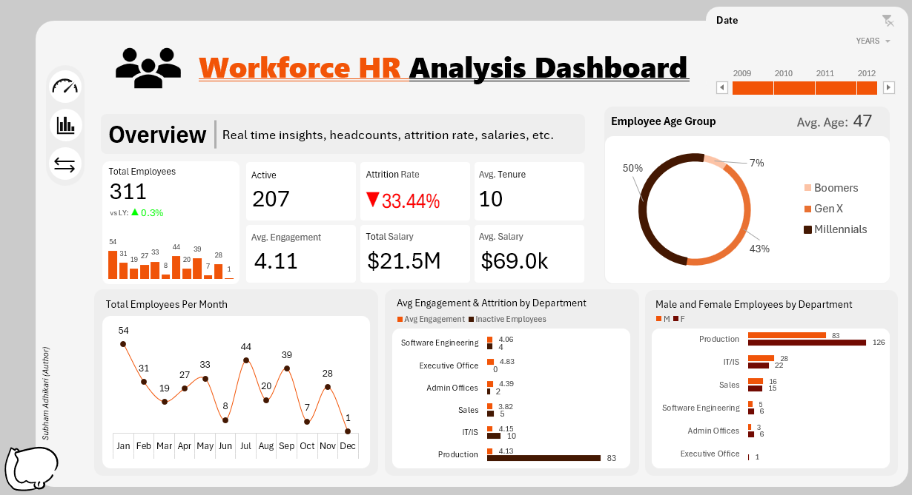
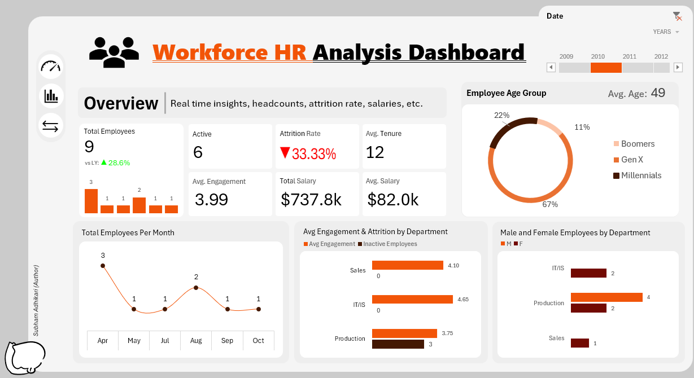

# 📊 Workforce HR Analysis Dashboard
### Excel-based HR MIS | Power Query · Power Pivot · Star Schema · DAX

---

## The Problem Most HR Teams Don't See Coming

A company with a **33% attrition rate** is quietly replacing one out of every three employees — every single year.

That means recruiting costs, onboarding time, lost institutional knowledge, and lower team productivity — all running in the background while leadership looks at headcount numbers that seem "fine."

This project was built to make those hidden problems visible, measurable, and actionable.

---

## What This Dashboard Reveals

Built on **13 years of workforce data (2006–2018)** across **311 employees** and **6 departments**, this HR MIS dashboard surfaces the metrics that actually drive workforce health.

### 🔴 Attrition is not an HR problem — it's a business cost problem

| Metric | Value |
|---|---|
| Overall Attrition Rate | **33.44%** |
| Hardest Hit Department | **Production (83 exits)** |
| Avg. Salary | **$69,000** |
| Total Payroll Exposure | **$21.5M** |

> If even 20% of those 104 exits could have been prevented with better engagement tracking, the business saves millions in replacement costs — without hiring a single new person.

---

### 📉 The departments bleeding talent tell you exactly where to act

- **Production** accounts for the overwhelming majority of attrition — 83 out of 104 total exits
- **IT/IS** follows at 10, despite being a smaller team — signaling a disproportionately high attrition risk per capita
- **Sales, Software Engineering, and Admin Offices** show low attrition — these retention practices are worth studying and replicating

**Business action:** Managers in Production should be immediately flagged for engagement reviews. What IT/IS is experiencing relative to its size is a warning sign that is easy to miss without this view.

---

### 👥 Workforce is aging — and your pipeline may not know it yet

| Generation | Share of Workforce |
|---|---|
| Gen X | 43% |
| Boomers | 50% |
| Millennials | 7% |

**Avg. Employee Age: 47**

> With Boomers at 50% of the workforce and an average age of 47, retirement-driven attrition will accelerate in the next 5–8 years. Only **7% of the workforce is Millennial** — that gap in succession planning is a ticking clock.

**Business action:** Start building a junior talent pipeline now, before the exits happen. Companies that wait for the gap to show up in headcount numbers are already 2–3 years late.

---

### 📅 Hiring surges in Q1 — then collapses. That pattern costs money.

The monthly employee trend shows a clear pattern: **January peaks at 54**, and then fluctuates wildly through the year, dropping to a single digit by December.

> Unplanned, reactive hiring is one of the most expensive workforce mistakes. It drives up recruitment costs, lowers the quality of hires, and puts pressure on managers who have to onboard people mid-cycle.

**Business action:** Use this monthly trend to build a **quarterly workforce plan** — anticipate need, hire ahead of the curve, and stop paying premium recruitment fees in panic-hiring situations.

---

### ⚖️ Gender distribution reveals hidden capacity in some departments

- **Production** is heavily male (83M vs 126F... wait — 126 female employees in Production alone is actually a strength)
- **IT/IS** shows near-equal split (28M / 22F) — a sign of healthier long-term talent depth
- **Executive Office** has only 1 employee represented — visibility into leadership diversity is almost zero

**Business action:** Departments with lopsided gender ratios and high attrition should be reviewed together — sometimes structural culture issues show up in both metrics simultaneously.

---

### 💡 Engagement Score is the early warning system most companies ignore

**Avg. Engagement Score: 4.11 / 5**

At first glance, the company-level engagement score of 4.11 looks healthy. However, when broken down by department alongside attrition counts, deeper signals appear.

Production shows the highest number of inactive employees (83) despite maintaining a reasonably strong engagement score (4.13). This suggests that even acceptable engagement levels do not always prevent large-scale attrition when workforce size is high.

Sales stands out as a potential risk area, with the lowest engagement score (3.82) among all departments. Lower engagement combined with attrition indicates a possible early warning sign that employees may be disengaging before leaving.

On the other hand, departments like Executive Office (4.83) and Admin Offices (4.39) show strong engagement with minimal or no attrition, indicating relatively stable workforce sentiment.

> This reinforces an important insight:
Engagement scores should never be interpreted only at the company level. They must be reviewed at the department level alongside attrition counts — that is where meaningful patterns and early warning signals emerge.

---

## Technical Architecture

This is not just a dashboard — it is a fully structured data model built inside Excel using industry-standard data engineering practices.

```
Master Data (Source)
        ↓
Power Query (ETL Layer)
  · dim_department      · dim_empstatus
  · dim_managers        · dim_performancescore
  · dim_position        · dim_state
  · fact_data           · DateTable (AI-assisted, continuous)
        ↓
Power Pivot (Modeling Layer)
  · Star Schema relationships
  · DAX Measures: CALCULATE, DATEADD, YoY %, custom KPIs
        ↓
Pivot Tables → Dashboard
  · Dynamic year slicer (2006–2018)
  · Conditional formatting with custom icon sets
  · Named cell references for clean formula management
```

**Tools used:** Excel · Power Query · Power Pivot · DAX · Star Schema Design

---

## Dashboard Preview

**All Years View**



**Single Year Filter (2010)**



---

## Key Takeaways for Any Business Reading This

1. **Attrition above 30% is a financial emergency, not an HR metric** — model the cost before ignoring it
2. **Department-level data always tells a different story than company-level averages** — never make people decisions from aggregate numbers
3. **Generational workforce composition predicts future risk** — plan succession 5 years ahead, not 5 months
4. **Monthly hiring patterns reveal planning maturity** — reactive hiring is one of the most measurable inefficiencies in any org
5. **Engagement scores are only useful when combined with attrition data** — alone, they can mask the real problem

---

## About This Project

**Domain:** Human Resources / Workforce Analytics  
**Tool:** Microsoft Excel (Power Query + Power Pivot + DAX)  
**Dataset:** Provided for educational purposes via a structured HR dataset  
**Author:** Subham Adhikari  
**Purpose:** Portfolio project demonstrating end-to-end MIS reporting — from raw data to executive dashboard

---

*If this analysis raised questions about your own workforce data — that's exactly the point.*
